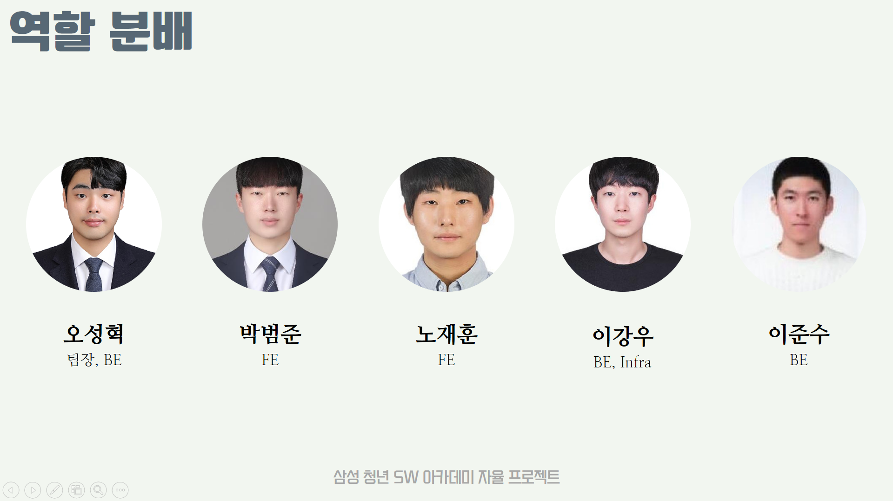

# 1. 프로젝트 소개

## 1. 프로젝트 기간

2024-10-14 ~ 2024-11-19(6주)

## 2. 기획 배경

-   어린이와 보호자가 함께 경험을 공유하며 유대감을 형성할 수 있도록 하기 위해
-   어린아이들이 뚜렷한 목표의식을 가지고 소비계획을 세울 수 있도록 유도하기 위해
-   금융약자인 어린이가 금융에 조금 더 쉽고 재미있게 다가갈 수 있도록 하기 위해
-   초고령사회로 나아가며 점점 감소하는 어린 고객층들을 잠재고객 또는 장기고객으로 유치하기 위해
-   어디서든 함께 사용가능한 금융 서비스를 제공하기 위해
-   ‘같이의 가치’를 실현하고 이를 통해 보다 의미 있는 일상을 만들어 갈 수 있게 하기 위해

## 3. 목표

-   금융, 경제 사고 확립
    -   자녀와 함께 돈을 모아 공동의 목표를 이루거나, 아이가 직접 용돈을 벌고, 체크카드를 사용하며 자금 관리를 초기부터 경험할 수 있는 기회를 제공
-   가치의 이해
    -   미션을 통해 용돈을 얻는 구조이므로 아이들이 성취감을 느낄 수 있음.
    -   책임감 있는 소비와 저축습관을 기르는 기회를 제공해 돈의 가치를 이해할 수 있음.
-   유대관계 증진
    -   부모와 자녀가 함께 돈을 모으고 계획하는 과정에서, 재정 관리에 대한 상호작용과 협력을 증진

---

# 2. 서비스 소개

### 1. 용돈 조르기 

-   아이가 용돈이 필요할 때, 부모에게 용돈을 조를 수 있습니다. 이후, 부모는 아이가 수행할 미션을 만들어 제시하고 아이는 해당 미션을 완료해야만 보상을 받을 수 있습니다. 이 과정을 통해 아이는 용돈을 단순히 받는 것이 아니라, 목표를 달성하고 성취감을 느끼며 보상의 가치를 경험하게 됩니다. 
-   아이가 미션을 완료하고 받은 용돈은 키즈월렛 통장에 입금합니다. 또, 키즈월렛 카드로 결제하면 다양한 혜택을 누릴 수 있으며, 매달 소비 내역을 손쉽게 확인하고 관리할 수 있습니다.  

  <i>조르기하기</i> 
  

 

  <i>FCM 알림 받고 조르기 내역 확인</i> 
  

 

    <i>미션 보내기</i> 
  

 

    <i>미션 수행</i> 
  

 

    <i>미션 수행 여부 확인 (실패)</i> 
  

 

    <i>미션 수행 여부 확인 (성공)</i> 
  

### 2. 같이 달리기 

-   아이가 얻고 싶은 상품을 구매하기 위해 노력하고 이를 부모가 지원해줍니다.  
-   아이가 상품의 사진, 금액, 기간을 설정합니다. 상품 구매라는 목표를 달성하기 위해 아이와 부모가 공동 저축을 하며 돈을 모읍니다. 아이와 부모는 목표금액을 바탕으로 서로 얼마만큼의 비율로 저축을 할지 정합니다. 
-   공동 저축 방법은 목표 기간과 동일한 키즈월렛의 적금통장을 발행합니다. 아이는 매달 꾸준히 노력하여 성취하는 경험을 할 수 있습니다. 
-   최소 목표금액은 만원입니다. 
-   기존의 월 단위 적금 시스템과 다르게 아이들의 특성을 고려하여 주 단위 적금 시스템을 제공합니다. 최소 목표 설정 기간 4주입니다. (서비스 확장 시, 월단위도 가능)  
-   사회공헌으로 고아원, 저소득층 등 아이들이 원하는 제품을 외부 사람들도 함께 달리기(펀딩)기능을 사용할 수 있습니다. 
 

    <i>목표 설정</i> 
  

 

    <i>금액 설정 및 같이 달리기 유저 설정</i> 
  

 

    <i>같이 달리기 거절</i> 
  

 

    <i>같이 달리기 수락</i> 
  

 

    <i>같이 달리기 해제</i> 
  

 

    <i>함께달리기 캠페인</i> 
  

 

### 3. 내 지갑 

-   사용자는 랜덤 계좌번호로 통장을 발급받을 수 있습니다. 
-   계좌의 거래내역을 조회할 수 있습니다. 
-   계좌에서 입금, 출금, 이체를 이용할 수 있습니다. 
-   계좌의 지출 통계를 그래프로 확인할 수 있습니다.  

  

      <i>통장 개설</i> 
    
  

   
  
  

      <i>카드 발급</i> 
    
  

   

  

      <i>입금 (지정된 계좌에서 입금)</i> 
    
  

   

  

      <i>출금 (지정된 계좌에서 출금)</i> 
    
  

   
  
  

      <i>지출 통계</i> 
    
  

   

### 4. 금융 퀴즈 

-   아이들이 금융 관련 상식을 퀴즈 형식으로 배우며 흥미를 느낄 수 있도록 구성된 퀴즈 기능입니다. 
-   부모와 자녀가 함께 참여할 수 있어 금융 지식 학습에 있어 자연스러운 소통의 기회를 제공합니다. 
-   이를 통해 아이는 금융의 기본 개념을 쉽게 이해하고, 올바른 소비 습관과 책임감 있는 자금 관리를 익힐 수 있습니다. 
-   퀴즈를 맞출때마다 포인트를 얻고 일정 포인트를 모으면 기프티콘을 얻을 수 있습니다.  

  

      <i>퀴즈</i> 
    
  
  

---

# 3. 기술 스택

### 인프라

Docker, Docker-compose, Jenkins, AWS, Linux

### 백엔드

Spring Boot, Spring Batch, Spring Data JPA, JUnit5,

### 프론트

Kotlin, Retrofit, Jetpack Compose

### 데이터베이스

Maria DB, Hibernate, Redis

### 메시징

FCM (Firebase Cloud Message)

### 툴

Jira, Gitlab, Postman, MatterMost, Notion, Figma, Android Studio, IntelliJ, wsl

---

# 4. 산출물

### ERD (click)

### 기능 명세서 (click)

coming soon

### API 명세서 (click)

coming soon

### 목업 (click)

coming soon

### 7. 멤버 구성 및 팀원 역할

